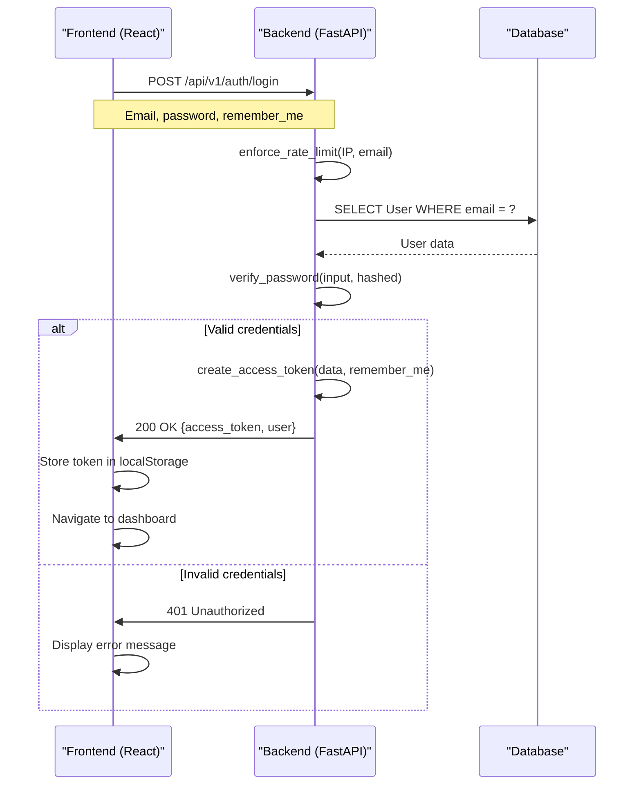
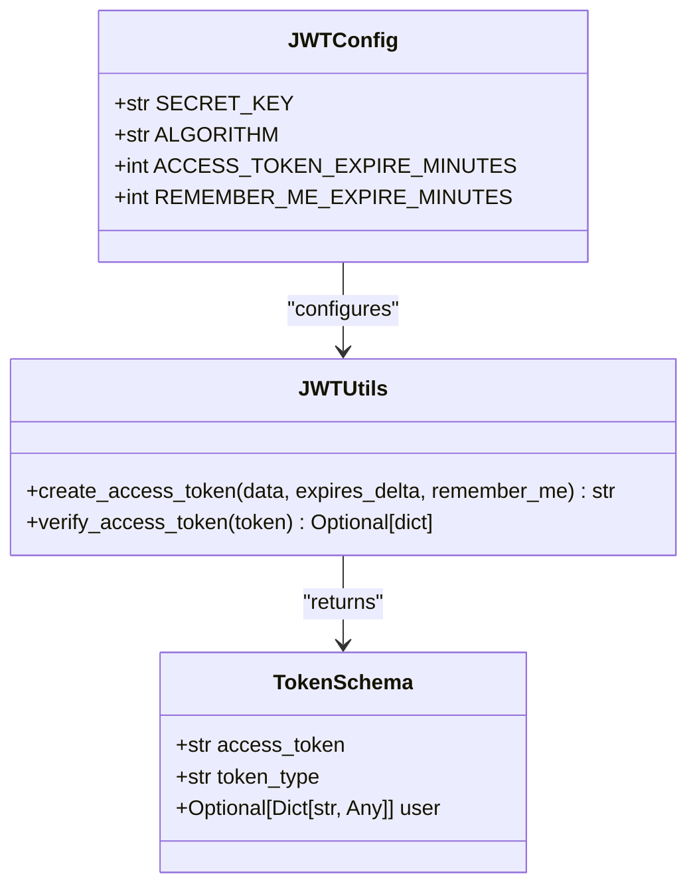
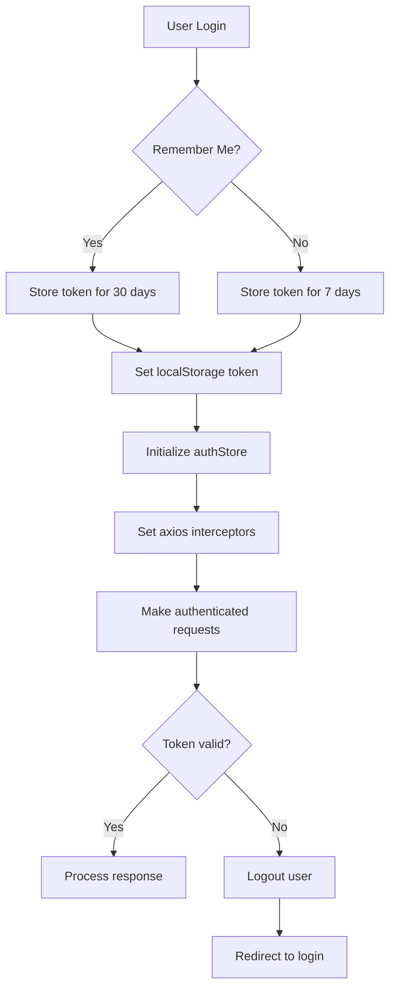
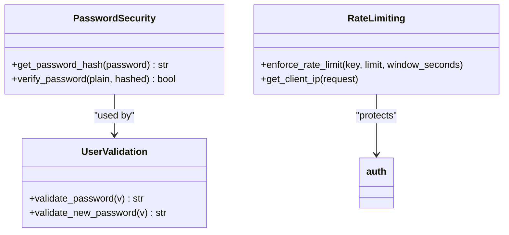
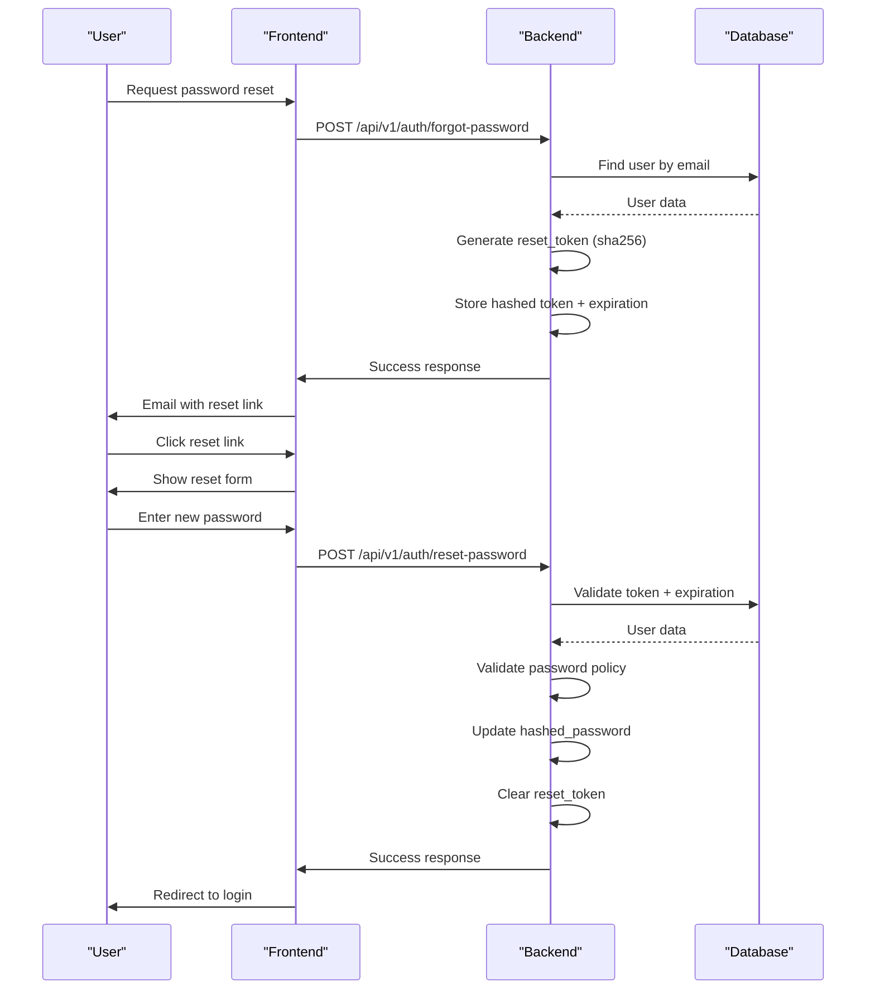
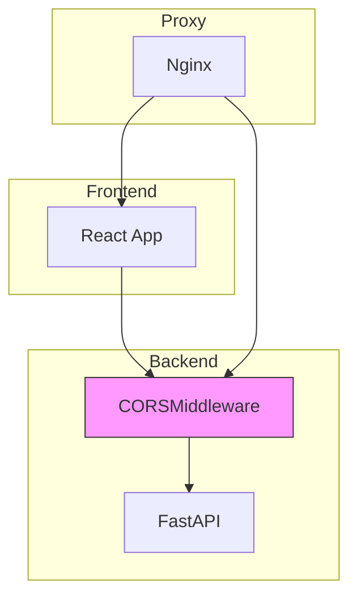
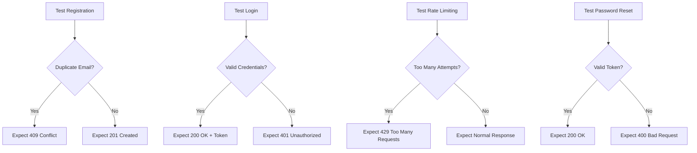

# API and Authentication Problems

<cite>
**Referenced Files in This Document**   
- [auth.py](file://app/api/routes/auth.py)
- [jwt.py](file://app/core/jwt.py)
- [security.py](file://app/core/security.py)
- [token.py](file://app/schemas/token.py)
- [user.py](file://app/schemas/user.py)
- [authStore.js](file://frontend/src/store/authStore.js)
- [api.js](file://frontend/src/services/api.js)
- [LoginPage.jsx](file://frontend/src/pages/Auth/LoginPage.jsx)
- [devlog_auth_backend.md](file://devlog_auth_backend.md)
</cite>

## Table of Contents
1. [Introduction](#introduction)
2. [Authentication Flow](#authentication-flow)
3. [JWT Token Management](#jwt-token-management)
4. [Frontend Authentication Handling](#frontend-authentication-handling)
5. [Common Authentication Issues](#common-authentication-issues)
6. [Security and Validation](#security-and-validation)
7. [Password Reset Mechanism](#password-reset-mechanism)
8. [CORS Configuration](#cors-configuration)
9. [Testing and Validation](#testing-and-validation)
10. [Troubleshooting Guide](#troubleshooting-guide)

## Introduction
This document provides comprehensive documentation for API and authentication-related issues in the TradeBot system. It covers the implementation details of JWT token generation, validation failures, session expiration, and authentication flow breakdowns. The analysis includes concrete examples from auth.py routes and jwt.py utilities, showing how tokens are issued and verified. The document addresses common invocation problems such as malformed requests, incorrect headers, and CORS issues between frontend and backend. It also covers domain model concerns like user state, token refresh mechanisms, and encrypted password handling.

## Authentication Flow



**Diagram sources**
- [auth.py](file://app/api/routes/auth.py#L32-L59)
- [LoginPage.jsx](file://frontend/src/pages/Auth/LoginPage.jsx#L24-L41)

**Section sources**
- [auth.py](file://app/api/routes/auth.py#L32-L60)
- [LoginPage.jsx](file://frontend/src/pages/Auth/LoginPage.jsx#L24-L41)

## JWT Token Management



**Diagram sources**
- [jwt.py](file://app/core/jwt.py#L1-L45)
- [token.py](file://app/schemas/token.py#L1-L12)

The JWT token management system in TradeBot implements a flexible token expiration strategy based on user preferences. The system uses two different expiration times:

- **Standard Session**: 7 days (10,080 minutes) for regular logins
- **Remember Me**: 30 days (43,200 minutes) when the user selects the "Remember Me" option

The token creation process follows these steps:
1. Extract user data (email and user ID)
2. Determine expiration based on remember_me flag
3. Create JWT payload with expiration timestamp
4. Encode token using HS256 algorithm and SECRET_KEY
5. Return token with user information

Token validation occurs through the `verify_access_token` function, which decodes the JWT and returns the payload if valid, or None if the token is expired or malformed.

**Section sources**
- [jwt.py](file://app/core/jwt.py#L1-L45)
- [auth.py](file://app/api/routes/auth.py#L47-L50)

## Frontend Authentication Handling



**Diagram sources**
- [authStore.js](file://frontend/src/store/authStore.js#L1-L69)
- [api.js](file://frontend/src/services/api.js#L1-L375)

The frontend authentication system uses Zustand for state management with persistence middleware to maintain user sessions across page reloads. Key components include:

- **authStore**: Manages user state, token, and authentication status
- **localStorage**: Persists tokens for session continuity
- **API interceptors**: Automatically adds Authorization headers to requests
- **401 handling**: Automatically logs out users and redirects to login on unauthorized access

The system initializes by checking localStorage for existing tokens and restoring the authentication state accordingly.

**Section sources**
- [authStore.js](file://frontend/src/store/authStore.js#L1-L69)
- [api.js](file://frontend/src/services/api.js#L1-L375)
- [LoginPage.jsx](file://frontend/src/pages/Auth/LoginPage.jsx#L1-L207)

## Common Authentication Issues

### Invalid Credentials Errors
The system returns HTTP 401 status for incorrect email or password combinations. The error handling is implemented in the login route:

```python
if not user or not verify_password(user_in.password, cast(str, user.hashed_password)):
    raise HTTPException(status_code=401, detail="Incorrect email or password")
```

### Token Expiration During Long Sessions
Users may experience token expiration during extended sessions. The system addresses this through:
- Configurable token expiration times
- "Remember Me" functionality for longer sessions
- Automatic logout and redirection on 401 responses

### CSRF-like Behavior in SPAs
The single-page application architecture prevents traditional CSRF attacks through:
- JWT-based authentication (stateless)
- No session cookies
- Token storage in localStorage
- Explicit token transmission in Authorization headers

**Section sources**
- [auth.py](file://app/api/routes/auth.py#L41-L42)
- [api.js](file://frontend/src/services/api.js#L82-L86)
- [authStore.js](file://frontend/src/store/authStore.js#L21-L28)

## Security and Validation



**Diagram sources**
- [security.py](file://app/core/security.py#L1-L16)
- [user.py](file://app/schemas/user.py#L8-L17)
- [auth.py](file://app/api/routes/auth.py#L35-L37)

The authentication system implements multiple security layers:

**Password Handling**
- Uses bcrypt hashing via passlib CryptContext
- Enforces strong password policies (12+ characters, mixed case, numbers, special characters)
- Hashes stored in database, never plaintext

**Rate Limiting**
- IP-based rate limiting (5 attempts per minute)
- Email-based rate limiting (10 attempts per hour)
- Prevents brute force attacks

**Input Validation**
- Email format validation using EmailStr
- Password complexity enforcement
- Secure token generation using secrets.token_urlsafe()

**Section sources**
- [security.py](file://app/core/security.py#L1-L16)
- [user.py](file://app/schemas/user.py#L8-L17)
- [auth.py](file://app/api/routes/auth.py#L35-L37)

## Password Reset Mechanism



**Diagram sources**
- [auth.py](file://app/api/routes/auth.py#L67-L176)
- [user.py](file://app/schemas/user.py#L34-L54)

The password reset mechanism follows security best practices:
- Uses cryptographically secure tokens (secrets.token_urlsafe)
- Stores only hashed tokens in the database
- One-hour expiration window
- No information leakage about user existence
- Enforces password policy on reset

**Section sources**
- [auth.py](file://app/api/routes/auth.py#L67-L176)
- [user.py](file://app/schemas/user.py#L34-L54)
- [models/user.py](file://app/models/user.py#L16-L17)

## CORS Configuration



**Diagram sources**
- [devlog_auth_backend.md](file://devlog_auth_backend.md#L300-L314)
- [nginx.conf](file://nginx/nginx.conf#L1-L42)

The CORS configuration enables secure communication between frontend and backend:

- **Development**: Allows all origins, credentials, methods, and headers
- **Production**: Configured through Nginx reverse proxy
- **Headers**: Includes security headers (X-Frame-Options, X-XSS-Protection)
- **Credentials**: Supports Authorization headers for JWT transmission

The Nginx configuration routes:
- Root requests to frontend
- /api/ requests to backend
- Health checks to backend

**Section sources**
- [devlog_auth_backend.md](file://devlog_auth_backend.md#L300-L314)
- [nginx.conf](file://nginx/nginx.conf#L1-L42)
- [frontend/nginx.conf](file://frontend/nginx.conf#L1-L57)

## Testing and Validation



**Diagram sources**
- [test_auth.py](file://tests/test_auth.py#L1-L50)
- [smoke_rate_limit.py](file://scripts/smoke_rate_limit.py#L33-L45)

The authentication system includes comprehensive test coverage:

**Unit Tests**
- Successful registration and login
- Duplicate email handling (409 Conflict)
- Invalid credentials (401 Unauthorized)
- Rate limiting enforcement

**Integration Tests**
- End-to-end authentication flow
- Token validation across requests
- Password reset workflow
- CORS header validation

The tests verify both positive and negative scenarios, ensuring robust error handling and security.

**Section sources**
- [test_auth.py](file://tests/test_auth.py#L1-L50)
- [smoke_rate_limit.py](file://scripts/smoke_rate_limit.py#L33-L45)

## Troubleshooting Guide

### Common Issues and Solutions

| Issue | Cause | Solution |
|------|------|----------|
| 401 Unauthorized | Invalid/expired token | Re-login to obtain new token |
| 409 Conflict | Duplicate email registration | Use different email or reset password |
| 429 Too Many Requests | Rate limiting triggered | Wait 1 minute for IP, 1 hour for email |
| Empty response | CORS misconfiguration | Verify frontend/backend origins match |
| Token not persisting | localStorage issue | Check browser storage permissions |

### Debugging Steps

1. **Check browser console** for JavaScript errors
2. **Verify network requests** in developer tools
3. **Confirm token presence** in localStorage
4. **Validate API endpoint URLs** and CORS headers
5. **Check server logs** for authentication errors
6. **Test with Postman/curl** to isolate frontend issues

### Environment-Specific Considerations

**Development**
- Tokens printed to console for debugging
- Development-mode password reset URLs
- No production SECRET_KEY validation

**Production**
- Strict SECRET_KEY requirement
- No debug information leakage
- Proper CORS origin restrictions

**Section sources**
- [auth.py](file://app/api/routes/auth.py)
- [api.js](file://frontend/src/services/api.js)
- [devlog_auth_backend.md](file://devlog_auth_backend.md)