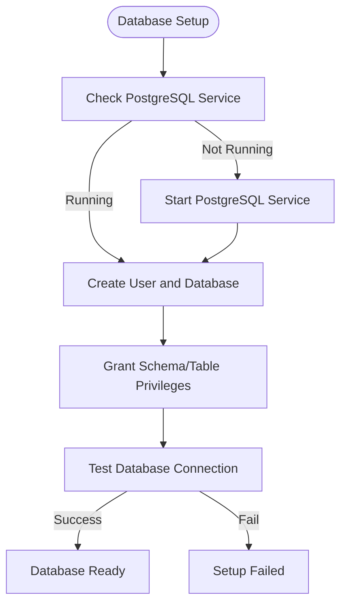

# Database and Migration Problems

<cite>
**Referenced Files in This Document**   
- [alembic.ini](file://alembic.ini)
- [env.py](file://alembic/env.py)
- [19adfce0d2a6_create_bot_config_table.py](file://alembic/versions/19adfce0d2a6_create_bot_config_table.py)
- [107856acfca7_add_leverage_column_to_bot_configs.py](file://alembic/versions/107856acfca7_add_leverage_column_to_bot_configs.py)
- [59a0e8d02f5a_add_strategy_and_ema_period_to_bot_.py](file://alembic/versions/59a0e8d02f5a_add_strategy_and_ema_period_to_bot_.py)
- [b7e3f2c1a9d8_merge_heads_d24f_a1b2.py](file://alembic/versions/b7e3f2c1a9d8_merge_heads_d24f_a1b2.py)
- [e2cbe40c4a2c_create_bot_state_table.py](file://alembic/versions/e2cbe40c4a2c_create_bot_state_table.py)
- [bot_config.py](file://app/models/bot_config.py)
- [user.py](file://app/models/user.py)
- [trade.py](file://app/models/trade.py)
- [backtest.py](file://app/models/backtest.py)
- [database.py](file://app/database.py)
- [db_connect.sh](file://scripts/db_connect.sh)
- [setup_local_db.sh](file://scripts/setup_local_db.sh)
- [README.md](file://README.md)
</cite>

## Table of Contents
1. [Introduction](#introduction)
2. [Database Initialization and Setup](#database-initialization-and-setup)
3. [Alembic Migration System Overview](#alembic-migration-system-overview)
4. [Common Migration Issues and Solutions](#common-migration-issues-and-solutions)
5. [Schema Evolution and Migration Scripts](#schema-evolution-and-migration-scripts)
6. [Domain Model and Schema Consistency](#domain-model-and-schema-consistency)
7. [Recovery Procedures for Broken Migrations](#recovery-procedures-for-broken-migrations)
8. [Troubleshooting Guide](#troubleshooting-guide)
9. [Conclusion](#conclusion)

## Introduction
This document provides a comprehensive guide to database connectivity and migration issues in the TradeBot system. It covers Alembic migration failures, schema mismatches, database initialization problems, and domain model consistency between SQLAlchemy models and PostgreSQL schema. The content is designed to be accessible to beginners while providing advanced recovery strategies for production databases.

**Section sources**
- [README.md](file://README.md#L454-L615)

## Database Initialization and Setup
The TradeBot system requires proper database initialization before use. Two primary scripts handle this process: `setup_local_db.sh` for local PostgreSQL installations and Docker-based initialization via `docker-compose.yml`. The `setup_local_db.sh` script creates the `tradebot_user` role and `tradebot_db` database, grants necessary privileges, and tests connectivity. It ensures the user has full access to the public schema, all tables, and sequences, with default privileges configured for future objects.

The `db_connect.sh` script provides a convenient way to access the PostgreSQL instance running in Docker. It verifies container status before establishing a connection using `docker exec`. Both scripts include helpful PostgreSQL commands for inspection, such as `\dt` for listing tables and `\d table_name` for describing table structure.

**Diagram sources**
- [setup_local_db.sh](file://scripts/setup_local_db.sh#L1-L79)
- [db_connect.sh](file://scripts/db_connect.sh#L1-L27)

**Section sources**
- [setup_local_db.sh](file://scripts/setup_local_db.sh#L1-L79)
- [db_connect.sh](file://scripts/db_connect.sh#L1-L27)

## Alembic Migration System Overview
The TradeBot system uses Alembic for database schema migrations, integrated with SQLAlchemy. The configuration is defined in `alembic.ini`, which specifies the script location, version directories, and database URL with parameter substitution for environment variables. The `env.py` file configures the migration environment, setting up logging, connecting to the database, and specifying the target metadata from `app.db_base.Base`.

Alembic operates in both offline and online modes. The online mode, used in production, creates an engine and associates a connection with the migration context. The system supports autogeneration of migration scripts when SQLAlchemy models change, allowing developers to create new revisions with `alembic revision --autogenerate`. Each migration script contains `upgrade()` and `downgrade()` functions that define forward and backward schema changes.

**Diagram sources**
- [alembic.ini](file://alembic.ini#L1-L142)
- [env.py](file://alembic/env.py#L1-L98)

**Section sources**
- [alembic.ini](file://alembic.ini#L1-L142)
- [env.py](file://alembic/env.py#L1-L98)

## Common Migration Issues and Solutions
Several common migration issues can occur in the TradeBot system. The "Migration failed: duplicate column" error typically happens when applying a migration that adds a column already present in the database, often due to manual schema changes or failed previous migrations. The "Database locked" issue occurs when another migration process holds an advisory lock, common in concurrent deployment scenarios. The "No such table" error indicates schema version mismatches, where the application expects tables created by migrations that haven't been applied.

Solutions include using `db_connect.sh` to inspect the current schema state and `setup_local_db.sh` to reset permissions. For duplicate column errors, verify the column exists before adding it using conditional logic in migration scripts. Database locks can be resolved by ensuring only one migration process runs at a time or by manually clearing advisory locks. Missing table issues are addressed by ensuring all migrations are applied in order using `alembic upgrade head`.

**Diagram sources**
- [README.md](file://README.md#L527-L615)
- [db_connect.sh](file://scripts/db_connect.sh#L1-L27)

**Section sources**
- [README.md](file://README.md#L527-L615)
- [db_connect.sh](file://scripts/db_connect.sh#L1-L27)

## Schema Evolution and Migration Scripts
The TradeBot system demonstrates incremental schema evolution through its migration history. The migration `19adfce0d2a6_create_bot_config_table.py` creates the initial `bot_configs` table with core trading parameters. Subsequent migrations like `107856acfca7_add_leverage_column_to_bot_configs.py` add new columns to support evolving requirements, in this case adding leverage support for futures trading.

The migration `59a0e8d02f5a_add_strategy_and_ema_period_to_bot_.py` shows the addition of strategy selection and customizable EMA periods, reflecting feature enhancements. The merge migration `b7e3f2c1a9d8_merge_heads_d24f_a1b2.py` resolves branching in the migration history, a common occurrence in team environments where multiple developers create migrations simultaneously. Each migration maintains a clear `downgrade()` path, allowing safe rollback of changes.

**Diagram sources**
- [19adfce0d2a6_create_bot_config_table.py](file://alembic/versions/19adfce0d2a6_create_bot_config_table.py#L1-L64)
- [107856acfca7_add_leverage_column_to_bot_configs.py](file://alembic/versions/107856acfca7_add_leverage_column_to_bot_configs.py#L1-L33)
- [59a0e8d02f5a_add_strategy_and_ema_period_to_bot_.py](file://alembic/versions/59a0e8d02f5a_add_strategy_and_ema_period_to_bot_.py#L1-L35)
- [b7e3f2c1a9d8_merge_heads_d24f_a1b2.py](file://alembic/versions/b7e3f2c1a9d8_merge_heads_d24f_a1b2.py#L1-L32)

**Section sources**
- [19adfce0d2a6_create_bot_config_table.py](file://alembic/versions/19adfce0d2a6_create_bot_config_table.py#L1-L64)
- [107856acfca7_add_leverage_column_to_bot_configs.py](file://alembic/versions/107856acfca7_add_leverage_column_to_bot_configs.py#L1-L33)
- [59a0e8d02f5a_add_strategy_and_ema_period_to_bot_.py](file://alembic/versions/59a0e8d02f5a_add_strategy_and_ema_period_to_bot_.py#L1-L35)
- [b7e3f2c1a9d8_merge_heads_d24f_a1b2.py](file://alembic/versions/b7e3f2c1a9d8_merge_heads_d24f_a1b2.py#L1-L32)

## Domain Model and Schema Consistency
Maintaining consistency between SQLAlchemy models and the PostgreSQL schema is critical for TradeBot's reliability. The `bot_config.py` model defines the `BotConfig` class with attributes like `leverage`, `strategy`, and `ema_period`, which must match the database columns created by migrations. The `user.py` model includes password reset fields that were added through migrations, demonstrating how domain models evolve with business requirements.

The `trade.py` model includes `realized_pnl` which was added after initial implementation, showing how financial tracking capabilities expanded. The `backtest.py` model's `market_type` field supports both spot and futures trading modes. Developers must ensure that model changes are accompanied by proper migrations, and that the `target_metadata` in `env.py` reflects all models to prevent autogenerate misses.

**Diagram sources**
- [bot_config.py](file://app/models/bot_config.py#L1-L59)
- [user.py](file://app/models/user.py#L1-L24)
- [trade.py](file://app/models/trade.py#L1-L27)
- [backtest.py](file://app/models/backtest.py#L1-L44)

**Section sources**
- [bot_config.py](file://app/models/bot_config.py#L1-L59)
- [user.py](file://app/models/user.py#L1-L24)
- [trade.py](file://app/models/trade.py#L1-L27)
- [backtest.py](file://app/models/backtest.py#L1-L44)

## Recovery Procedures for Broken Migrations
When migrations fail, several recovery strategies are available. For minor issues, downgrading to a previous revision using `alembic downgrade -1` allows fixing the migration script before retrying. When migration history branches occur, creating a merge migration with `alembic merge` resolves multiple heads, as demonstrated by `b7e3f2c1a9d8_merge_heads_d24f_a1b2.py`.

For severe corruption, manual fixes may be necessary using `db_connect.sh` to directly modify the schema or `setup_local_db.sh` to reset permissions. In extreme cases, recreating the database and reapplying all migrations ensures consistency. Production databases require careful planning: always backup before migration attempts, test on staging environments, and use transactional DDL where possible to maintain atomicity.

**Diagram sources**
- [b7e3f2c1a9d8_merge_heads_d24f_a1b2.py](file://alembic/versions/b7e3f2c1a9d8_merge_heads_d24f_a1b2.py#L1-L32)
- [db_connect.sh](file://scripts/db_connect.sh#L1-L27)
- [setup_local_db.sh](file://scripts/setup_local_db.sh#L1-L79)

**Section sources**
- [b7e3f2c1a9d8_merge_heads_d24f_a1b2.py](file://alembic/versions/b7e3f2c1a9d8_merge_heads_d24f_a1b2.py#L1-L32)
- [db_connect.sh](file://scripts/db_connect.sh#L1-L27)
- [setup_local_db.sh](file://scripts/setup_local_db.sh#L1-L79)

## Troubleshooting Guide
Common database issues can be diagnosed using the provided tools. Connection errors are checked with `docker-compose logs postgres` and resolved by ensuring the PostgreSQL container is running. Migration failures are addressed by running `alembic upgrade head` manually and examining the output. For persistent issues, a complete database reset is performed with `docker-compose down -v` followed by `docker-compose up -d`.

The `db_monitor.py` script provides database health monitoring, while `db_connect.sh` offers direct access for inspection. When schema mismatches occur, compare the SQLAlchemy models in `app/models/` with the actual database structure using `\d table_name` commands. The `SQLALCHEMY_ECHO=true` environment variable enables query logging to debug ORM issues.

**Section sources**
- [README.md](file://README.md#L527-L615)
- [db_connect.sh](file://scripts/db_connect.sh#L1-L27)
- [db_monitor.py](file://scripts/db_monitor.py)

## Conclusion
The TradeBot system's database management relies on a robust Alembic migration framework that enables safe, incremental schema evolution. By following proper procedures for migration creation, testing, and deployment, teams can maintain database consistency across environments. The provided scripts and tools facilitate both routine operations and recovery from common issues. Understanding the relationship between SQLAlchemy models and database schema is essential for developers to implement new features while maintaining data integrity.