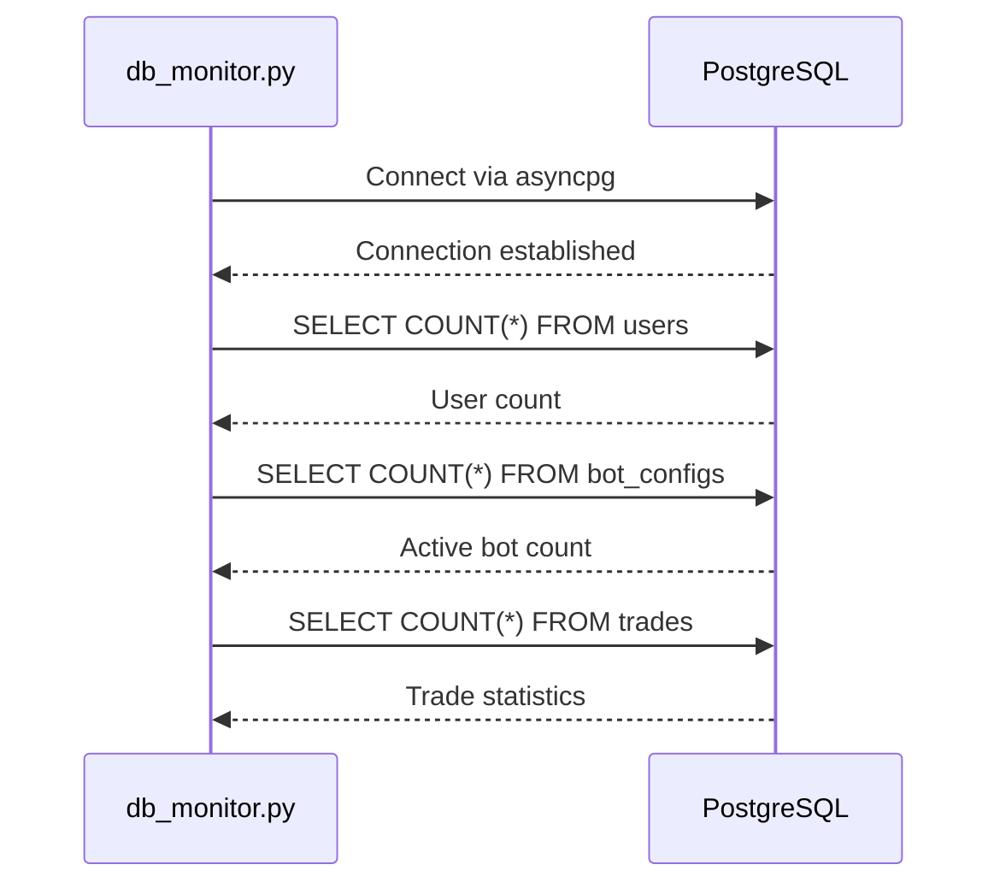
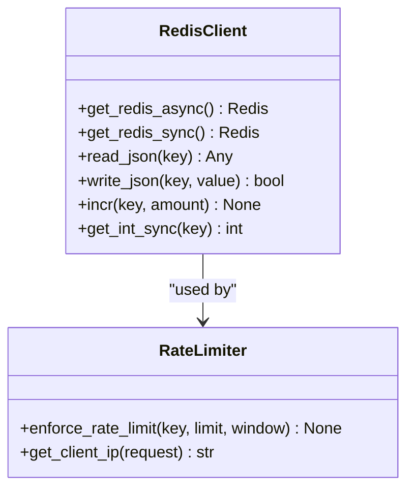
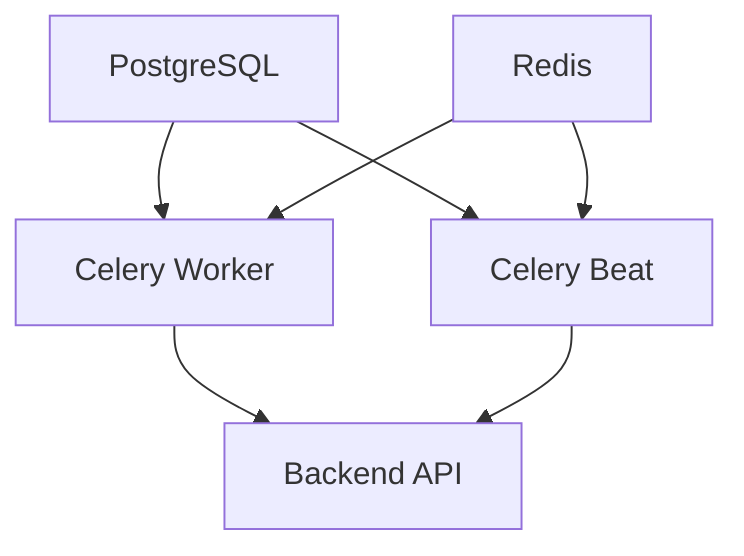
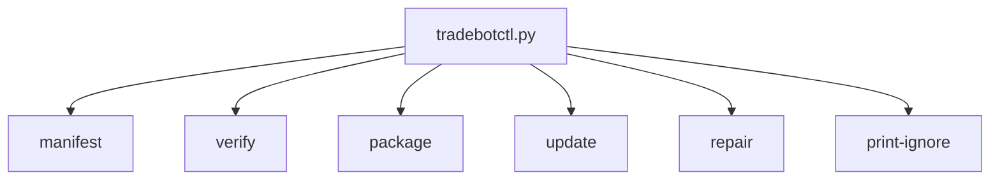

# Runtime Errors and Service Failures

<cite>
**Referenced Files in This Document**   
- [health.py](file://app/api/routes/health.py)
- [docker-compose.yml](file://docker-compose.yml)
- [db_monitor.py](file://scripts/db_monitor.py)
- [redis_ping.py](file://scripts/redis_ping.py)
- [tradebotctl.py](file://scripts/tradebotctl.py)
- [celery_app.py](file://app/core/celery_app.py)
- [database.py](file://app/database.py)
- [redis_client.py](file://app/core/redis_client.py)
- [rate_limit.py](file://app/core/rate_limit.py)
- [cache.py](file://app/core/cache.py)
- [main.py](file://app/main.py)
</cite>

## Table of Contents
1. [Introduction](#introduction)
2. [Service Health Monitoring](#service-health-monitoring)
3. [Database Connectivity and Failures](#database-connectivity-and-failures)
4. [Redis and Rate Limiting](#redis-and-rate-limiting)
5. [Celery Worker Dependencies](#celery-worker-dependencies)
6. [Nginx Reverse Proxy Configuration](#nginx-reverse-proxy-configuration)
7. [Domain Models for Service Health](#domain-models-for-service-health)
8. [Common Issues and Solutions](#common-issues-and-solutions)
9. [Monitoring and Debugging Tools](#monitoring-and-debugging-tools)
10. [Conclusion](#conclusion)

## Introduction
The TradeBot application is a complex trading automation system composed of multiple interconnected services including FastAPI backend, Celery workers, PostgreSQL, Redis, and Nginx reverse proxy. This document provides comprehensive guidance on diagnosing and resolving runtime errors and service failures within this ecosystem. The focus is on practical troubleshooting techniques, service interdependencies, and monitoring strategies that enable both beginners and experienced operators to maintain system reliability in production environments.

The architecture follows a microservices pattern where each component has specific responsibilities and dependencies. Understanding these relationships is crucial for effective debugging and system maintenance. This document covers implementation details of health checks, connectivity testing, error handling, and recovery procedures across all major components of the TradeBot system.

## Service Health Monitoring

The TradeBot application implements a comprehensive health monitoring system that enables operators to quickly assess the status of various services. The FastAPI backend exposes a health check endpoint that serves as the primary indicator of application health.

```mermaid
flowchart TD
A[Client] --> B[/health]
B --> C{Health Check}
C --> D[Return Status]
D --> E[{"status": "healthy",<br/>"service": "tradebot-backend"}]
```

**Diagram sources**
- [health.py](file://app/api/routes/health.py#L6-L8)

The health endpoint returns a simple JSON response indicating the service status. This endpoint is used by the docker-compose healthcheck configuration to determine when the backend service is ready to accept traffic. The health check is designed to be lightweight and does not perform deep dependency checks, ensuring fast response times.

**Section sources**
- [health.py](file://app/api/routes/health.py#L6-L8)

## Database Connectivity and Failures

Database connectivity is critical for the TradeBot application, as PostgreSQL serves as the primary data store for user accounts, bot configurations, trading history, and system state. The application implements robust database connection management with proper error handling and retry mechanisms.

The docker-compose configuration includes a health check for the PostgreSQL service that uses the `pg_isready` command to verify database availability before starting dependent services:

```yaml
healthcheck:
  test: [ "CMD-SHELL", "pg_isready -U tradebot_user -d tradebot_db" ]
  interval: 10s
  timeout: 5s
  retries: 5
```

When the backend service starts, it waits for the database to become healthy before attempting to establish connections. The application uses SQLAlchemy with asyncpg for asynchronous database operations, providing efficient connection pooling and query execution.

For diagnosing database connectivity issues, the TradeBot distribution includes a monitoring script that connects directly to the database and retrieves key statistics:



**Diagram sources**
- [db_monitor.py](file://scripts/db_monitor.py#L13-L133)
- [docker-compose.yml](file://docker-compose.yml#L22-L26)

The `db_monitor.py` script provides detailed insights into database health by querying various tables and displaying statistics in a formatted table. This script can be run independently to verify database connectivity and assess data integrity without going through the application API.

Common database issues include connection timeouts, which can occur when the database is under heavy load or when network connectivity is unstable. The application handles these scenarios through proper exception handling and connection retry logic. When a connection timeout occurs, the application logs the error and attempts to re-establish the connection for subsequent operations.

**Section sources**
- [db_monitor.py](file://scripts/db_monitor.py#L13-L133)
- [database.py](file://app/database.py#L1-L24)
- [docker-compose.yml](file://docker-compose.yml#L3-L26)

## Redis and Rate Limiting

Redis plays a crucial role in the TradeBot architecture, serving multiple purposes including caching, rate limiting, and as a message broker for Celery. The application implements a comprehensive Redis client system that supports both synchronous and asynchronous operations.

The docker-compose configuration includes health checks for Redis that account for password authentication:

```yaml
healthcheck:
  test: [ "CMD-SHELL", 'if [ -n "$REDIS_PASSWORD" ]; then redis-cli -a "$REDIS_PASSWORD" ping; else redis-cli ping; fi' ]
  interval: 10s
  timeout: 5s
  retries: 5
```

The application code includes a robust Redis client implementation that provides singleton access to Redis connections:



**Diagram sources**
- [redis_client.py](file://app/core/redis_client.py#L1-L129)
- [rate_limit.py](file://app/core/rate_limit.py#L1-L43)

The Redis client provides helper methods for common operations such as JSON serialization, counters, and cache management. This abstraction simplifies Redis usage throughout the application and ensures consistent error handling.

Rate limiting is implemented using Redis to track request counts per client IP address. The rate limiter gracefully degrades when Redis is unavailable, allowing requests to proceed without enforcement rather than failing completely. This design ensures that the application remains functional even if Redis experiences temporary outages.

For connectivity testing, the TradeBot distribution includes a simple Redis ping script that verifies Redis availability and demonstrates basic operations:

```python
async def main():
    url = os.environ.get("REDIS_URL", "redis://localhost:6379/0")
    r = from_url(url, encoding="utf-8", decode_responses=True)
    try:
        pong = await r.ping()
        print("PING:", pong)
        val = await r.incr("smoke:test:counter")
        print("INCR:", val)
        await r.expire("smoke:test:counter", 60)
        got = await r.get("smoke:test:counter")
        print("GET:", got)
    finally:
        await r.close()
        print("CLOSED")
```

This script can be used to verify Redis connectivity and test basic operations, making it a valuable tool for diagnosing Redis-related issues.

**Section sources**
- [redis_ping.py](file://scripts/redis_ping.py#L3-L17)
- [redis_client.py](file://app/core/redis_client.py#L1-L129)
- [rate_limit.py](file://app/core/rate_limit.py#L1-L43)
- [docker-compose.yml](file://docker-compose.yml#L29-L47)

## Celery Worker Dependencies

Celery workers are essential for executing background tasks in the TradeBot application, including running trading bots, processing periodic jobs, and handling asynchronous operations. The workers have critical dependencies on both Redis (as a message broker) and PostgreSQL (for data access).

The docker-compose configuration shows the dependencies between services:



**Diagram sources**
- [docker-compose.yml](file://docker-compose.yml#L104-L145)

The Celery configuration is defined in `celery_app.py`, which specifies the broker and result backend URLs, task configurations, and scheduled tasks:

```python
CELERY_BROKER_URL = os.getenv("CELERY_BROKER_URL", "redis://localhost:6379/0")
CELERY_RESULT_BACKEND = os.getenv("CELERY_RESULT_BACKEND", "redis://localhost:6379/0")

celery_app = Celery(
    "tradebot",
    broker=CELERY_BROKER_URL,
    backend=CELERY_RESULT_BACKEND,
    include=['app.core.bot_tasks', 'app.core.cache_warmup_tasks']
)
```

The application implements important Celery configurations for production reliability:

- `task_acks_late=True`: Ensures tasks are not acknowledged until completion, preventing loss if a worker crashes
- `worker_prefetch_multiplier=1`: Prevents workers from prefetching too many tasks, avoiding the "thundering herd" problem
- `task_reject_on_worker_lost=True`: Rejects tasks if the worker process is lost, allowing them to be requeued
- Time limits for tasks to prevent hanging operations

Celery Beat is used to schedule periodic tasks, such as running all active bots every minute and resetting bot states daily. These scheduled tasks are defined in the Celery configuration and executed by the celery-beat service.

When Celery workers fail, common causes include:
- Redis connectivity issues preventing task queuing
- Database connection timeouts during task execution
- Memory exhaustion from processing large datasets
- Python exceptions in task code

The application handles these scenarios through proper error logging, task retry mechanisms, and health checks that restart failed workers.

**Section sources**
- [celery_app.py](file://app/core/celery_app.py#L1-L44)
- [bot_tasks.py](file://app/core/bot_tasks.py#L1-L518)
- [docker-compose.yml](file://docker-compose.yml#L104-L188)

## Nginx Reverse Proxy Configuration

Nginx serves as the reverse proxy for the TradeBot application, handling incoming HTTP requests and routing them to the appropriate backend services. The configuration is designed for production deployment with SSL termination and proper security settings.

The docker-compose configuration for Nginx includes:

```yaml
nginx:
  image: nginx:alpine
  container_name: tradebot-nginx
  restart: unless-stopped
  ports:
    - "80:80"
    - "443:443"
  volumes:
    - ./nginx/nginx.conf:/etc/nginx/nginx.conf
    - ./nginx/ssl:/etc/nginx/ssl
  depends_on:
    - frontend
    - backend
  networks:
    - tradebot-network
```

Nginx acts as the entry point for all external traffic, routing requests to either the frontend (static assets) or backend (API) services. This architecture provides several benefits:

- Single entry point for all services
- SSL termination at the proxy level
- Load balancing capabilities
- Request filtering and security
- Caching of static assets

The health check for Nginx verifies that the service is responding to HTTP requests:

```yaml
healthcheck:
  test: [ "CMD-SHELL", "wget -qO- http://localhost:80/health > /dev/null 2>&1 || exit 1" ]
  interval: 30s
  timeout: 10s
  retries: 3
```

When diagnosing Nginx-related issues, operators should check:
- Configuration syntax with `nginx -t`
- Log files for error messages
- Port conflicts with other services
- SSL certificate validity
- Upstream service availability

The reverse proxy configuration also handles CORS headers and ensures proper request forwarding to the backend services.

**Section sources**
- [docker-compose.yml](file://docker-compose.yml#L219-L244)
- [nginx.conf](file://nginx/nginx.conf)

## Domain Models for Service Health

The TradeBot application implements several domain models related to service health, timeout handling, and retry mechanisms. These models provide a structured approach to managing service dependencies and failures.

The application uses environment variables to configure timeout and retry parameters:

```python
celery_app.conf.update(
    task_time_limit=int(os.getenv("CELERY_TASK_TIME_LIMIT", "180")),
    task_soft_time_limit=int(os.getenv("CELERY_TASK_SOFT_TIME_LIMIT", "150")),
)
```

These settings define hard and soft time limits for Celery tasks, ensuring that long-running operations are terminated gracefully. The soft time limit allows tasks to catch the timeout exception and perform cleanup operations before termination.

For database operations, the application implements proper connection management with async context managers and error handling:

```python
async def get_db_stats():
    try:
        conn = await asyncpg.connect(DATABASE_URL.replace("+asyncpg", ""))
        # Perform database operations
        await conn.close()
    except Exception as e:
        print(f"❌ Veritabanı hatası: {e}")
```

The error handling strategy follows a progressive approach:
1. Log the error with appropriate severity level
2. Return a meaningful error response to the client
3. Attempt recovery or fallback behavior when possible
4. Notify administrators for critical failures

The application also implements caching strategies to reduce load on external services and improve response times. The cache system includes:
- Cache hit/miss tracking
- Cache expiration based on data recency
- Warm-up procedures during startup
- Fallback to direct data access when cache is unavailable

These domain models ensure that the application can handle transient failures gracefully while maintaining data consistency and service availability.

**Section sources**
- [celery_app.py](file://app/core/celery_app.py#L17-L23)
- [db_monitor.py](file://scripts/db_monitor.py#L13-L133)
- [cache.py](file://app/core/cache.py#L1-L192)
- [main.py](file://app/main.py#L46-L70)

## Common Issues and Solutions

This section addresses common runtime errors and service failures in the TradeBot application, along with practical solutions for diagnosis and resolution.

### Worker Crashes
Celery worker crashes can occur due to various reasons, including memory exhaustion, unhandled exceptions, or dependency failures. To diagnose worker crashes:

1. Check worker logs using `docker-compose logs celery-worker`
2. Verify Redis and database connectivity
3. Monitor system resource usage
4. Review task code for potential infinite loops or memory leaks

Solutions include:
- Restarting the worker container
- Increasing memory allocation
- Implementing proper error handling in tasks
- Adding resource monitoring and alerts

### Database Connection Timeouts
Database connection timeouts typically occur under high load or network instability. To address this:

1. Use the `db_monitor.py` script to verify database connectivity
2. Check database server resource usage
3. Optimize slow queries
4. Adjust connection pool settings

The application's database configuration includes proper error handling that allows recovery from temporary connectivity issues.

### Redis Rate Limit Failures
When Redis is unavailable, the rate limiting system gracefully degrades, allowing requests to proceed without enforcement. To diagnose Redis issues:

1. Use the `redis_ping.py` script to test connectivity
2. Check Redis memory usage and eviction policies
3. Verify authentication credentials
4. Monitor network connectivity

Solutions include:
- Restarting the Redis container
- Increasing memory allocation
- Configuring persistent storage
- Implementing Redis clustering for high availability

### Container Restarts and Resource Allocation
For persistent issues, container restarts can resolve transient problems:

```bash
docker-compose restart postgres
docker-compose restart redis
docker-compose restart backend
```

Resource allocation should be monitored and adjusted based on actual usage patterns. The docker-compose configuration includes resource limits and health checks to ensure stable operation.

**Section sources**
- [tradebotctl.py](file://scripts/tradebotctl.py#L1-L458)
- [db_monitor.py](file://scripts/db_monitor.py#L13-L133)
- [redis_ping.py](file://scripts/redis_ping.py#L3-L17)
- [docker-compose.yml](file://docker-compose.yml)

## Monitoring and Debugging Tools

The TradeBot application includes several tools for monitoring and debugging service failures. These tools provide operators with the information needed to diagnose and resolve issues quickly.

The `tradebotctl.py` script provides a command-line interface for various maintenance operations:



This tool can be used to verify file integrity, create distribution packages, and repair corrupted installations.

For process inspection, operators can use standard Docker commands along with the provided monitoring scripts:

```bash
# View container logs
docker-compose logs backend
docker-compose logs celery-worker
docker-compose logs postgres

# Run database monitor
python scripts/db_monitor.py

# Test Redis connectivity
python scripts/redis_ping.py

# Check system health
curl http://localhost:8000/health
```

The application also includes comprehensive logging that captures important events and errors. Log files are stored in the `logs` directory and rotated regularly to prevent disk space issues.

For advanced debugging in production environments, operators can:
- Enable detailed logging temporarily
- Use distributed tracing to follow request flows
- Monitor system metrics (CPU, memory, network)
- Analyze error patterns over time
- Implement alerting for critical failures

These tools and techniques provide a comprehensive approach to monitoring and debugging the TradeBot application, ensuring high availability and reliability in production environments.

**Section sources**
- [tradebotctl.py](file://scripts/tradebotctl.py#L1-L458)
- [db_monitor.py](file://scripts/db_monitor.py#L1-L142)
- [redis_ping.py](file://scripts/redis_ping.py#L1-L22)
- [docker-compose.yml](file://docker-compose.yml)

## Conclusion
The TradeBot application's architecture is designed with resilience and maintainability in mind. By understanding the interdependencies between services and implementing proper monitoring and error handling, operators can effectively diagnose and resolve runtime errors and service failures.

Key takeaways include:
- Health checks are essential for automated service management
- Proper error handling and retry mechanisms improve system reliability
- Monitoring scripts provide valuable insights into service health
- Container orchestration simplifies deployment and recovery
- Graceful degradation ensures availability during partial failures

For production environments, it is recommended to implement additional monitoring, alerting, and automated recovery procedures. Regular system maintenance, log analysis, and performance tuning will help ensure the TradeBot application operates reliably and efficiently.

The tools and techniques described in this document provide a solid foundation for maintaining the TradeBot application, from basic troubleshooting for beginners to advanced debugging for experienced operators.