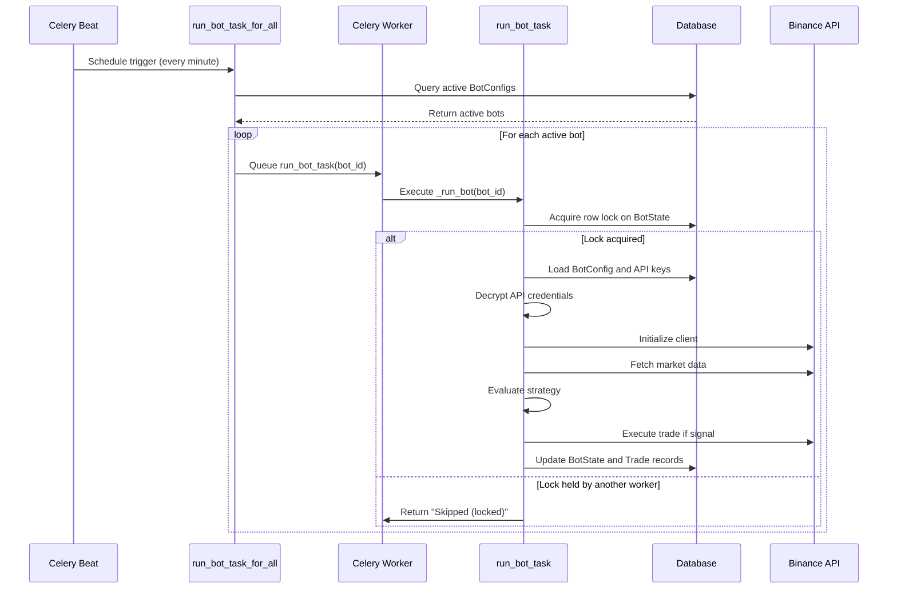
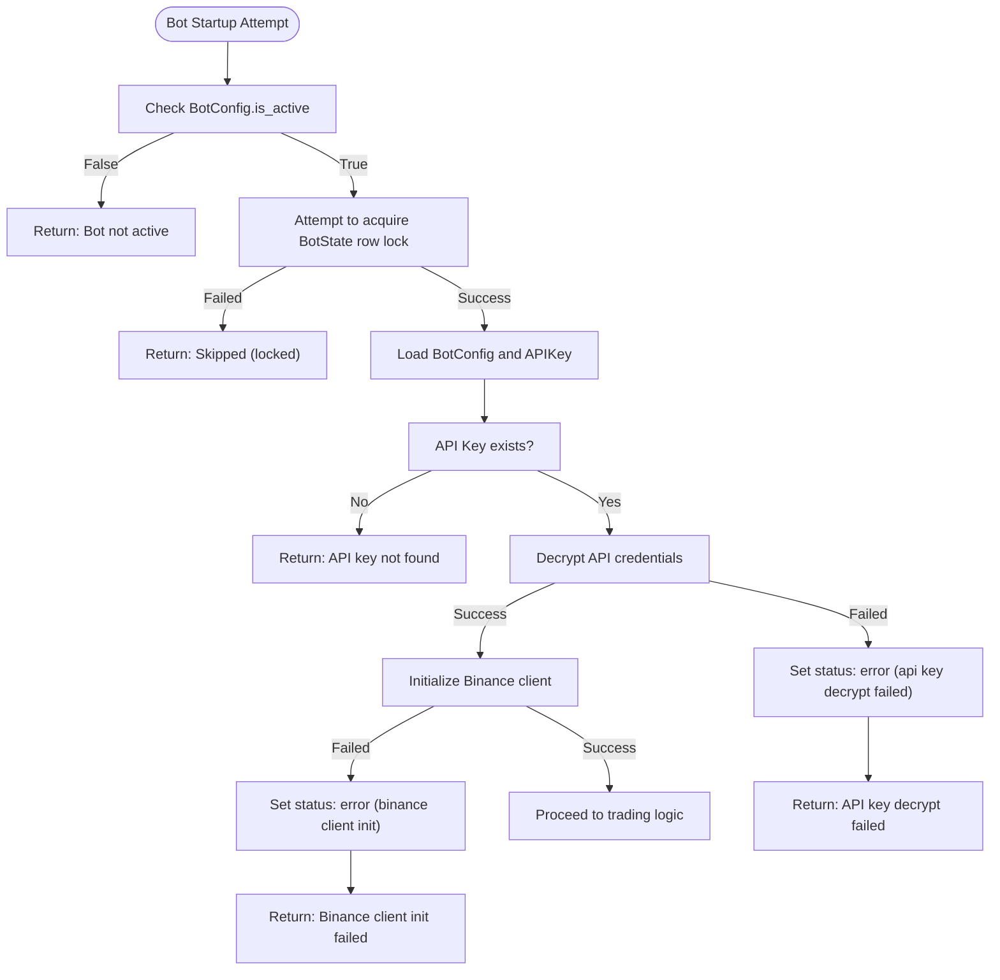
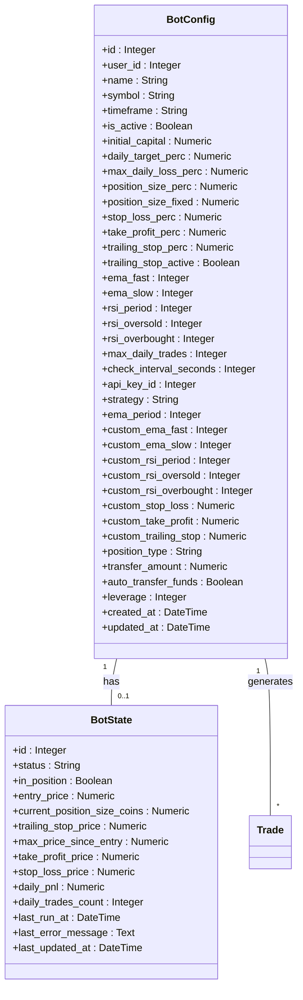
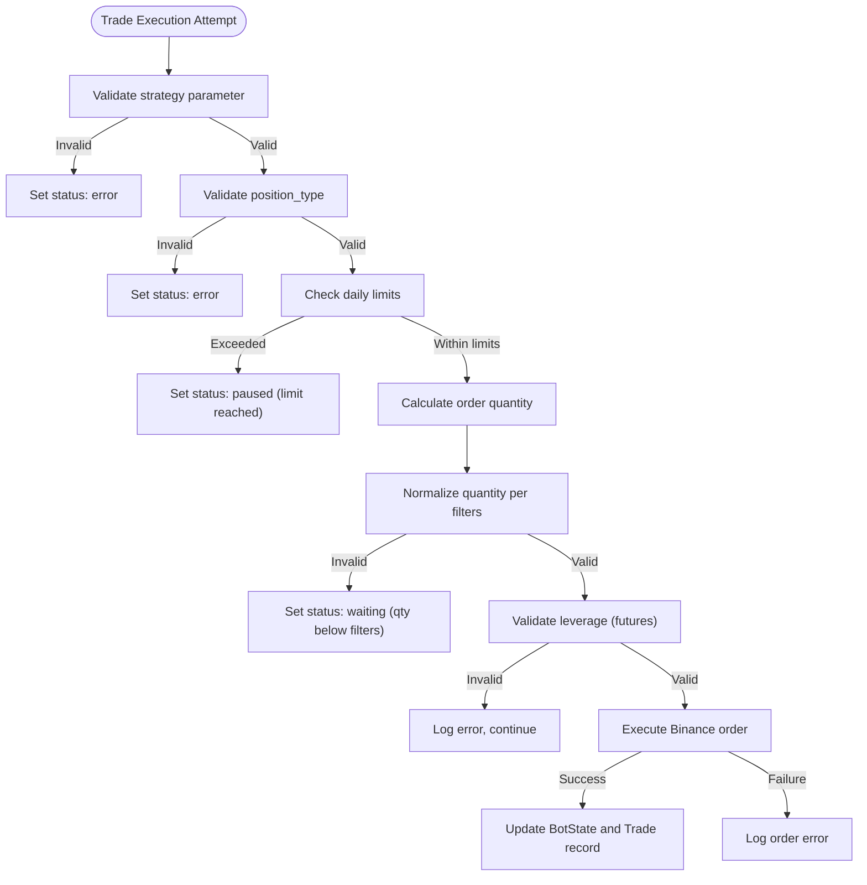
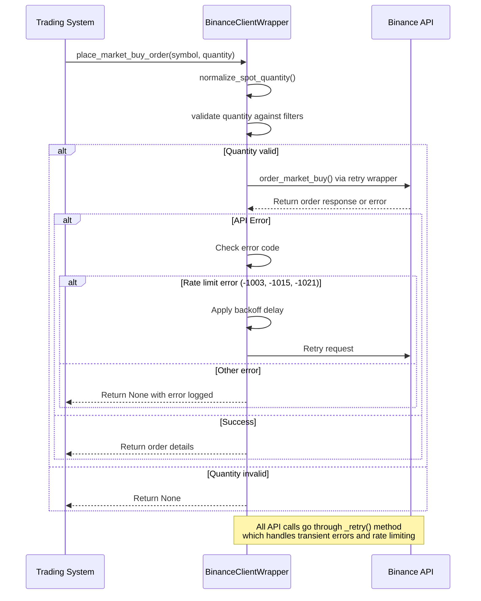
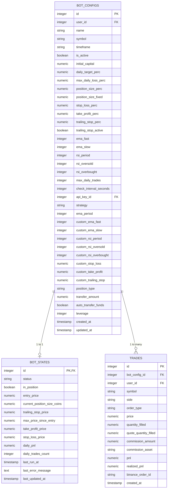
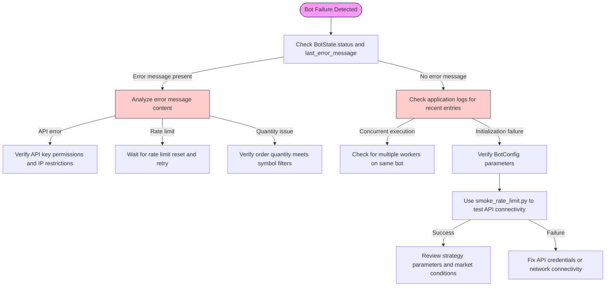

# Trading Bot Execution Failures

<cite>
**Referenced Files in This Document**   
- [bot_tasks.py](file://app/core/bot_tasks.py)
- [binance_client.py](file://app/core/binance_client.py)
- [bot_config.py](file://app/models/bot_config.py)
- [bot_state.py](file://app/models/bot_state.py)
- [smoke_rate_limit.py](file://scripts/smoke_rate_limit.py)
- [celery_app.py](file://app/core/celery_app.py)
</cite>

## Table of Contents
1. [Introduction](#introduction)
2. [Bot Lifecycle and Execution Flow](#bot-lifecycle-and-execution-flow)
3. [Common Startup Failures](#common-startup-failures)
4. [Unexpected Stops and State Mismatches](#unexpected-stops-and-state-mismatches)
5. [Incorrect Trade Execution](#incorrect-trade-execution)
6. [API Integration and Rate Limiting](#api-integration-and-rate-limiting)
7. [Domain Models: BotConfig and BotState](#domain-models-botconfig-and-botstate)
8. [Debugging and Diagnostics](#debugging-and-diagnostics)
9. [Solutions and Best Practices](#solutions-and-best-practices)

## Introduction
This document provides a comprehensive analysis of trading bot execution failures in the algorithmic trading system. It examines the root causes of bot startup failures, unexpected stops, and incorrect trade executions. The analysis focuses on the implementation details of Celery periodic tasks in `bot_tasks.py`, which evaluate bot configurations and execute trading logic. Common issues such as invalid strategy parameters, missing API keys, rate limiting by Binance (illustrated via `smoke_rate_limit.py`), and incorrect market type settings (spot vs futures) are thoroughly documented. The document also covers domain models like `BotConfig` and `BotState`, explaining how state mismatches can cause malfunctions. Practical debugging workflows using smoke tests and log tracing are provided, along with solutions for synchronization issues, order rejection, and leverage configuration errors.

## Bot Lifecycle and Execution Flow
The trading bot system operates through a scheduled Celery task architecture that manages the lifecycle of trading bots. The execution flow begins with the `run_bot_task_for_all` periodic task that triggers every minute, which in turn calls individual `run_bot_task` functions for each active bot configuration. This architecture ensures that all active bots are evaluated at regular intervals according to their configured check intervals.

The bot execution process follows a strict sequence: first, the system acquires a database row lock on the `BotState` record to prevent concurrent execution, then validates API credentials, initializes the Binance client, and evaluates trading conditions based on the configured strategy. The system implements a daily reset mechanism through the `reactivate_bots_after_reset` task that runs at UTC midnight, which resets daily counters and reactivates bots that were paused due to daily limits.

**Diagram sources**
- [bot_tasks.py](file://app/core/bot_tasks.py#L111-L119)
- [celery_app.py](file://app/core/celery_app.py#L35-L40)

**Section sources**
- [bot_tasks.py](file://app/core/bot_tasks.py#L111-L119)
- [celery_app.py](file://app/core/celery_app.py#L35-L40)

## Common Startup Failures
Trading bots may fail to start due to several configuration and authentication issues. The most common startup failure occurs when API keys are missing or invalid. The system attempts to decrypt API credentials from the database, and if this process fails, the bot is placed in an error state with the status "error (api key decrypt failed)". This typically happens when the encryption key has changed or when the stored credentials are corrupted.

Another frequent startup issue is the failure to initialize the Binance client, which results in the status "error (binance client init)". This can occur due to network connectivity problems, invalid API key/secret combinations, or IP restrictions imposed by Binance. The system uses environment variables to determine whether to connect to the Binance testnet or mainnet, and mismatches between these settings and the API key permissions can cause initialization failures.

Rate limiting by Binance is another significant factor that can prevent bot startup. The `smoke_rate_limit.py` script demonstrates how the system handles rate limiting by implementing retry logic with exponential backoff. When the Binance API returns rate limit errors (codes -1003, -1015, -1021), the system applies a jittered backoff strategy before retrying the request. The retry configuration is controlled by environment variables `BINANCE_RETRY_MAX_ATTEMPTS` and `BINANCE_RETRY_BACKOFF_BASE`, allowing operators to tune the retry behavior based on their specific requirements.

**Diagram sources**
- [bot_tasks.py](file://app/core/bot_tasks.py#L125-L185)
- [smoke_rate_limit.py](file://scripts/smoke_rate_limit.py#L34-L37)

**Section sources**
- [bot_tasks.py](file://app/core/bot_tasks.py#L125-L185)
- [smoke_rate_limit.py](file://scripts/smoke_rate_limit.py#L34-L37)

## Unexpected Stops and State Mismatches
Bots may stop unexpectedly due to state mismatches between the `BotConfig` and `BotState` domain models. The `BotConfig` entity represents the persistent configuration of a trading bot, including parameters like strategy type, trading pair, and risk management settings. In contrast, the `BotState` entity maintains the runtime state of the bot, such as current status, position information, and daily performance metrics.

A common cause of unexpected stops is the concurrency control mechanism implemented through database row locking. When multiple Celery workers attempt to execute the same bot task simultaneously, only one worker can acquire the row lock on the `BotState` record. The other workers receive an `OperationalError` and return "Skipped (locked)", effectively preventing concurrent execution but potentially causing missed trading opportunities if the lock is held for extended periods.

Daily limits can also cause bots to pause unexpectedly. The system implements several daily constraints that, when reached, automatically pause the bot by updating its status. These include `max_daily_trades`, `max_daily_loss_perc`, and `daily_target_perc`. When any of these limits is reached, the bot status is updated to reflect the reason (e.g., "paused (max_daily_trades reached)") and no further trades are executed until the daily reset. This behavior is intentional to prevent excessive trading or significant losses, but it can appear as an unexpected stop to users who are unaware of these limits.

**Diagram sources**
- [bot_config.py](file://app/models/bot_config.py#L4-L57)
- [bot_state.py](file://app/models/bot_state.py#L4-L22)

**Section sources**
- [bot_config.py](file://app/models/bot_config.py#L4-L57)
- [bot_state.py](file://app/models/bot_state.py#L4-L22)

## Incorrect Trade Execution
Incorrect trade execution can occur due to various factors related to strategy parameters, market type settings, and order validation. The system supports different trading strategies, with the "ema" strategy being the primary implementation. When an unknown strategy is specified in the `BotConfig`, the bot enters an error state with the message "Unknown strategy: {strategy}", preventing any trades from being executed.

Market type configuration is critical for correct trade execution. The `position_type` field in `BotConfig` must be set to either "spot" or "futures", as validated by the Pydantic model validator. Incorrect settings can lead to the use of wrong API endpoints and order types. For futures trading, the system automatically configures isolated margin mode and one-way position mode to prevent conflicts with existing positions.

Order validation failures are another common cause of incorrect trade execution. The system normalizes order quantities according to the symbol's LOT_SIZE and MIN_NOTIONAL filters. If the calculated order quantity does not meet these requirements, the bot status is set to "waiting (qty below filters)" and no trade is executed. This can happen when the configured position size is too small for the current market price or when the account balance is insufficient.

Leverage configuration errors specifically affect futures trading. The system validates leverage values between 1 and 125, with a default of 10. For safety, the code caps leverage at 50 even if higher values are configured. If leverage setting fails, the system logs an error but continues execution, potentially leading to unexpected margin requirements and liquidation risks.

**Diagram sources**
- [bot_tasks.py](file://app/core/bot_tasks.py#L231-L359)
- [binance_client.py](file://app/core/binance_client.py#L170-L221)

**Section sources**
- [bot_tasks.py](file://app/core/bot_tasks.py#L231-L359)
- [binance_client.py](file://app/core/binance_client.py#L170-L221)

## API Integration and Rate Limiting
The integration with Binance API is implemented through the `BinanceClientWrapper` class, which provides a robust interface with built-in error handling and retry mechanisms. The wrapper handles various API exceptions, including rate limiting (codes -1003, -1015, -1021), which trigger a retry with exponential backoff. The retry parameters are configurable through environment variables, allowing operators to adjust the behavior based on their API usage patterns and rate limit allowances.

The system distinguishes between spot and futures trading APIs, using different endpoints and order types for each market type. For spot trading, the system can place simple market orders or OCO (One-Cancels-the-Other) orders for take-profit and stop-loss execution. For futures trading, the system places market orders and separately configures stop-loss and take-profit protections using reduce-only orders to prevent position increases.

Rate limiting is monitored through the X-MBX-USED-WEIGHT-1m response header from Binance API. When the used weight exceeds the threshold (configurable via `BINANCE_WEIGHT_THRESHOLD`), the system applies a polite delay to avoid hitting rate limits. This proactive approach helps maintain API availability and prevents service disruptions due to excessive request rates.

The `smoke_rate_limit.py` script provides a testing mechanism for rate limiting behavior, simulating multiple failed login attempts to verify that the system's rate limiting protection is functioning correctly. This smoke test confirms that after a certain number of failed attempts, the system returns a 429 status code, indicating that rate limiting is enforced.

**Diagram sources**
- [binance_client.py](file://app/core/binance_client.py#L74-L96)
- [smoke_rate_limit.py](file://scripts/smoke_rate_limit.py#L34-L37)

**Section sources**
- [binance_client.py](file://app/core/binance_client.py#L74-L96)
- [smoke_rate_limit.py](file://scripts/smoke_rate_limit.py#L34-L37)

## Domain Models: BotConfig and BotState
The `BotConfig` and `BotState` domain models form the core of the trading bot system, representing the configuration and runtime state respectively. The `BotConfig` model contains all persistent settings for a trading bot, including strategy parameters, risk management settings, and API integration details. It is linked to the `BotState` model through a one-to-one relationship, ensuring that each bot configuration has exactly one state record.

The `BotConfig` model includes several critical fields for trading operations:
- **Strategy configuration**: `strategy`, `ema_fast`, `ema_slow`, `rsi_period`, and related parameters
- **Risk management**: `stop_loss_perc`, `take_profit_perc`, `max_daily_loss_perc`, and `daily_target_perc`
- **Position management**: `position_type` (spot/futures), `leverage`, and `auto_transfer_funds`
- **API integration**: `api_key_id` for authentication

The `BotState` model tracks the dynamic aspects of bot operation:
- **Execution status**: `status` field indicating current state (running, stopped, error, etc.)
- **Position tracking**: `in_position`, `entry_price`, and `current_position_size_coins`
- **Risk protection levels**: `stop_loss_price`, `take_profit_price`, and `trailing_stop_price`
- **Performance metrics**: `daily_pnl` and `daily_trades_count`

State mismatches between these models can cause various malfunctions. For example, if the `BotConfig.is_active` flag is set to false while the `BotState.status` indicates "running", the bot will not execute new trades despite appearing active in the user interface. Similarly, if the `BotState` record is missing or corrupted, the concurrency control mechanism may fail, leading to potential race conditions in trade execution.

**Diagram sources**
- [bot_config.py](file://app/models/bot_config.py#L4-L57)
- [bot_state.py](file://app/models/bot_state.py#L4-L22)

**Section sources**
- [bot_config.py](file://app/models/bot_config.py#L4-L57)
- [bot_state.py](file://app/models/bot_state.py#L4-L22)

## Debugging and Diagnostics
Effective debugging of trading bot failures requires a systematic approach combining log analysis, state inspection, and targeted testing. The primary diagnostic tool is the `BotState` record, which provides real-time visibility into the bot's status and recent error messages. When a bot fails, the `last_error_message` field typically contains specific information about the failure cause, such as API errors or configuration issues.

The system provides several debugging workflows:
1. **Smoke testing**: The `smoke_rate_limit.py` script can be used to verify rate limiting behavior and API connectivity
2. **Log tracing**: The application logs detailed information about each bot execution attempt, including API calls and error conditions
3. **State inspection**: The `/api/v1/bot-states/{id}` endpoint allows direct inspection of the current bot state
4. **Status streaming**: The `/api/v1/bots/{id}/status-stream` endpoint provides real-time updates on bot status through Server-Sent Events

For API-related issues, examining the Binance API response codes is crucial. Common error codes include:
- **-2015**: Invalid API key or IP restriction
- **-1013**: Invalid quantity or price (often due to LOT_SIZE or MIN_NOTIONAL violations)
- **-2021**: Order would immediately trigger (for stop orders)
- **-4046**: Margin type already set (can be safely ignored)

The system's retry mechanism with exponential backoff can be observed in the logs, showing the delay between retry attempts. This information helps diagnose whether issues are transient (resolved by retry) or persistent (requiring configuration changes).

**Diagram sources**
- [bot_tasks.py](file://app/core/bot_tasks.py#L153-L163)
- [smoke_rate_limit.py](file://scripts/smoke_rate_limit.py#L14-L45)

**Section sources**
- [bot_tasks.py](file://app/core/bot_tasks.py#L153-L163)
- [smoke_rate_limit.py](file://scripts/smoke_rate_limit.py#L14-L45)

## Solutions and Best Practices
To prevent trading bot execution failures, several best practices should be followed:

**Configuration Best Practices:**
- Always validate API keys before activating bots
- Set appropriate daily limits to prevent excessive trading
- Use conservative leverage values, especially when starting
- Configure position sizes that meet the MIN_NOTIONAL requirements for the target trading pair
- Regularly review and update strategy parameters based on market conditions

**Operational Best Practices:**
- Monitor bot status through the status stream endpoint
- Implement alerting for error states and daily limit breaches
- Regularly review logs for warning messages and retry patterns
- Use the daily reset feature to ensure consistent bot behavior
- Test configuration changes in demo mode before applying to live trading

**API Integration Best Practices:**
- Use dedicated API keys with appropriate permissions and IP restrictions
- Monitor API usage to stay within rate limits
- Implement proper error handling for transient API issues
- Keep API client libraries up to date
- Use testnet for configuration testing when possible

For synchronization issues, ensure that only one Celery worker processes bot tasks for a given bot configuration. The row locking mechanism prevents concurrent execution, but having multiple workers can still lead to unnecessary resource consumption. Order rejection can often be prevented by properly normalizing order quantities according to the symbol's LOT_SIZE and MIN_NOTIONAL filters, which the system does automatically but can be verified through testing.

Leverage configuration errors can be avoided by understanding the difference between cross and isolated margin modes in futures trading. The system defaults to isolated margin mode, which limits risk to the allocated margin. When configuring leverage, consider the volatility of the trading pair and your risk tolerance, as higher leverage increases both potential returns and liquidation risk.